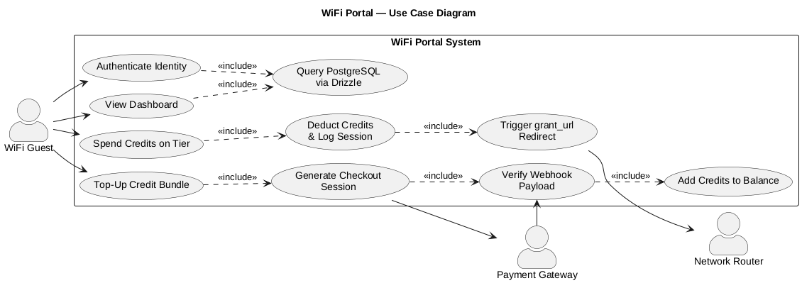

# Use Case: UC-01 — WiFi Portal Access & Credit Management

## 1. Brief Description

A WiFi Guest authenticates through the captive portal, views their dashboard,
and manages internet access by spending or topping up credits. Spending credits
on a tier grants router-level internet access; topping up purchases a credit
bundle through an external payment gateway.

## 2. Use Case Diagram

> Source: [`uc-01-wifi-portal.puml`](./uc-01-wifi-portal.puml) — render with
> `java -jar plantuml.jar -tpng uc-01-wifi-portal.puml` (uses the built-in
> Smetana layout engine, no Graphviz required).

## 3. Actors

| Actor | Type | Role |
| --- | --- | --- |
| **WiFi Guest** | Primary | Connects to WiFi, authenticates, and manages credits. |
| **Network Router** | Secondary | Receives the `grant_url` redirect to open internet access. |
| **Payment Gateway** | Secondary | Hosts checkout and emits the payment webhook. |

## 4. Use Cases

| Use Case | Description | Relationships |
| --- | --- | --- |
| **Authenticate Identity** | Guest signs in to the portal. | `«include»` Query PostgreSQL via Drizzle |
| **View Dashboard** | Guest views balance, tiers, and session info. | `«include»` Query PostgreSQL via Drizzle |
| **Query PostgreSQL via Drizzle** | Reads/writes persistent data through the Drizzle ORM. | included by Authenticate & View Dashboard |
| **Spend Credits on Tier** | Guest selects a tier and consumes credits. | `«include»` Deduct Credits & Log Session |
| **Deduct Credits & Log Session** | Decrements balance and records the session. | `«include»` Trigger grant_url Redirect |
| **Trigger grant_url Redirect** | Signals the router to grant internet access. | → Network Router |
| **Top-Up Credit Bundle** | Guest buys additional credits. | `«include»` Generate Checkout Session |
| **Generate Checkout Session** | Creates a checkout at the payment gateway. | → Payment Gateway, `«include»` Verify Webhook Payload |
| **Verify Webhook Payload** | Validates the gateway's payment webhook. | ← Payment Gateway, `«include»` Add Credits to Balance |
| **Add Credits to Balance** | Credits the verified amount to the account. | — |

## 5. Preconditions

- The WiFi network and captive portal are operational.
- The PostgreSQL database is reachable via Drizzle.
- For top-ups, the payment gateway is reachable.

## 6. Postconditions

- **Authenticate / View Dashboard:** Guest identity is verified and account data
  is displayed.
- **Spend Credits on Tier:** Balance is decremented, the session is logged, and
  the router grants internet access.
- **Top-Up Credit Bundle:** A verified payment results in credits added to the
  guest's balance.

## 7. Main Flows

### 7.1 Authenticate & View Dashboard
1. The Guest submits credentials (**Authenticate Identity**).
2. The system queries PostgreSQL via Drizzle to verify the Guest.
3. The Guest is shown the dashboard (**View Dashboard**), which again queries
   PostgreSQL via Drizzle for balance and session data.

### 7.2 Spend Credits on a Tier
1. The Guest selects a tier (**Spend Credits on Tier**).
2. The system deducts credits and logs the session
   (**Deduct Credits & Log Session**).
3. The system triggers the `grant_url` redirect
   (**Trigger grant_url Redirect**) to the **Network Router**, opening internet
   access.

### 7.3 Top-Up Credit Bundle
1. The Guest chooses a credit bundle (**Top-Up Credit Bundle**).
2. The system generates a checkout session
   (**Generate Checkout Session**) with the **Payment Gateway**.
3. On payment, the **Payment Gateway** sends a webhook that the system verifies
   (**Verify Webhook Payload**).
4. The system credits the verified amount (**Add Credits to Balance**).

## 8. Business Rules

- **BR-1:** All identity and balance reads/writes go through Drizzle/PostgreSQL.
- **BR-2:** Internet access is granted only after credits are deducted and the
  session is logged.
- **BR-3:** Credits are added only after the webhook payload is successfully
  verified (never on checkout creation alone).
